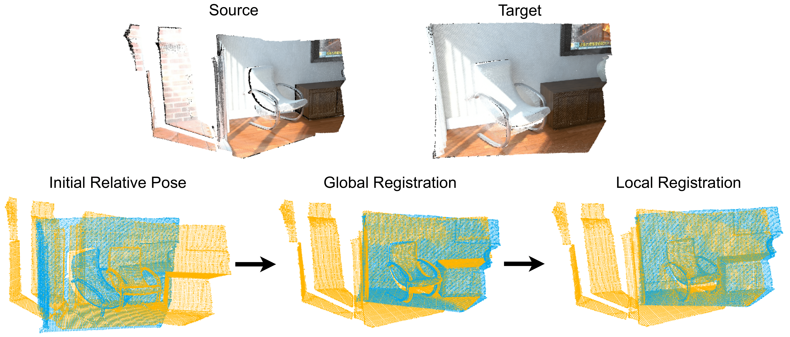
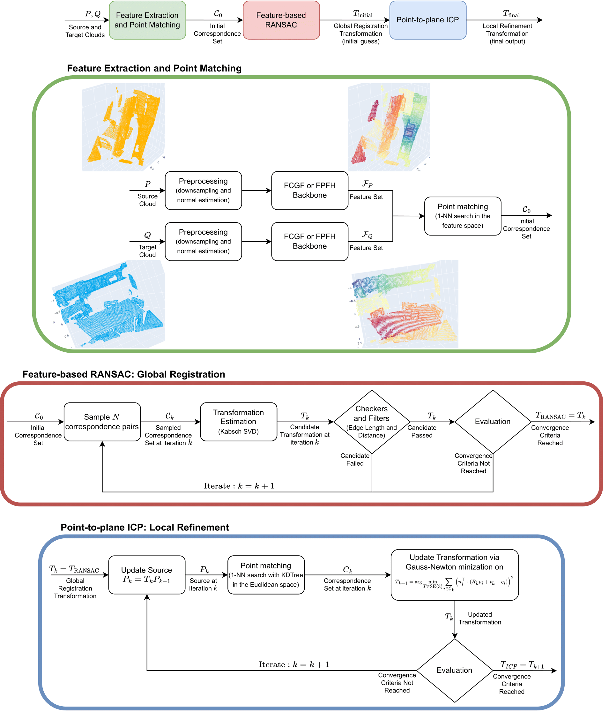
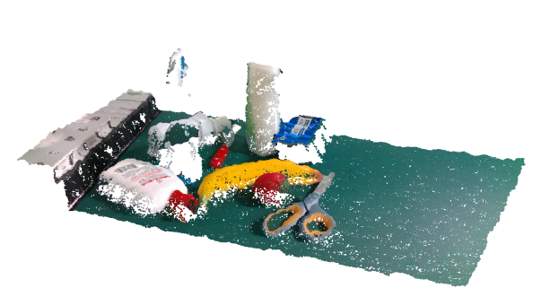
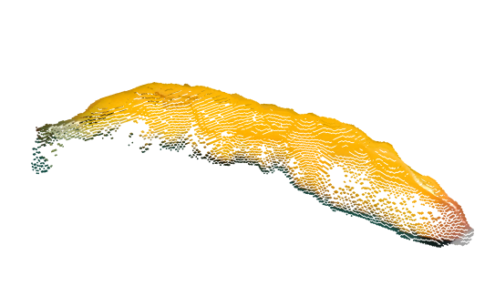
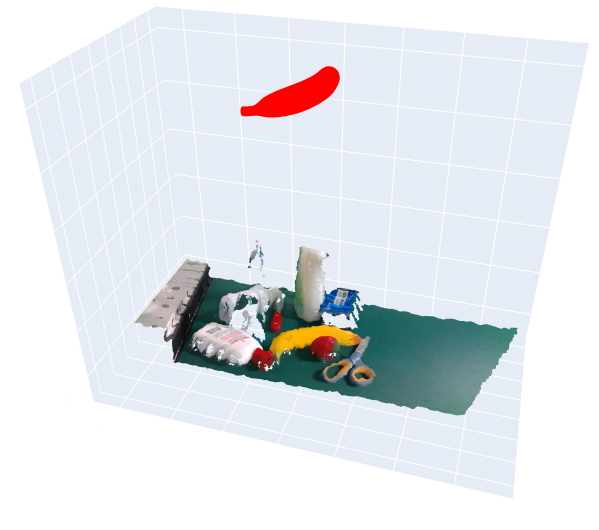
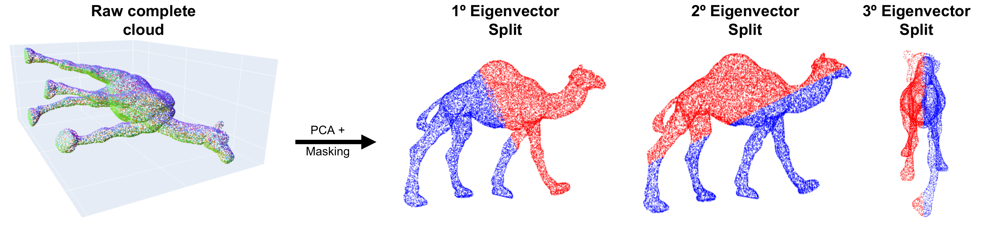
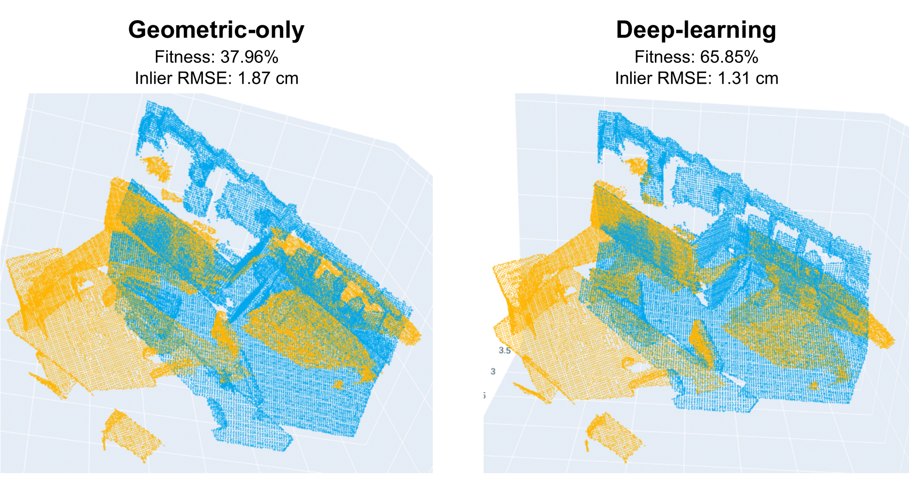
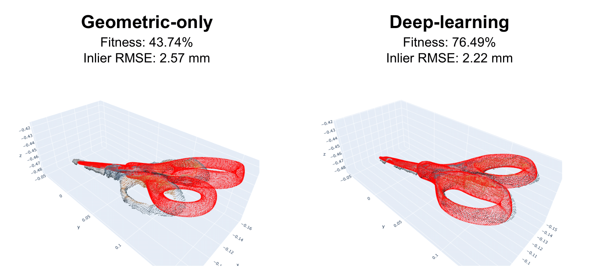
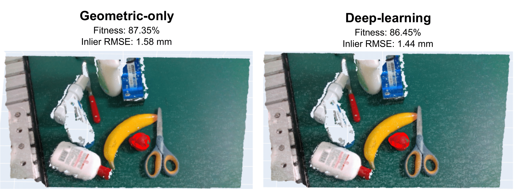

# AI-Based Point Cloud Registration

> **Master’s Thesis (M.Sc. in Mechatronics Engineering) — Politecnico di Torino**  
> **Partnership:** Comau (internship + thesis)

**Author:** Gabriel Antonio Corteletti Tápias  
**Email:** gacorteletti@gmail.com  
**LinkedIn:** https://www.linkedin.com/in/gabriel-corteletti/  


## Project overview

This repository contains the code developed for my Master’s thesis on 3D point-cloud registration.  
The core idea is to keep the downstream registration stack fixed and isolate the impact of the feature descriptor. We implement the same global-to-local pipeline twice in Open3D: once using classical geometric features and once using a deep-learning backbone.

<p align="center">
  
</p>


## Pipelines

Two variants are provided:

- Geometric-only pipeline: Fast Point Feature Histograms (FPFH) → feature matching → RANSAC global registration → point-to-plane ICP refinement  
- AI-based pipeline: Fully Convolutional Geometric Features (FCGF) → feature matching → RANSAC global registration → point-to-plane ICP refinement  

Both variants share the same hyperparameters, include stage-level timing, and log iteration counts for RANSAC and ICP to enable fair comparisons across setups.

High-level structure:

1. Preprocessing: voxel downsampling + normal estimation  
2. Feature extraction: FPFH (classical) or FCGF (learned)  
3. Point matching: 1-NN in feature space (initial correspondence set)  
4. Global registration: feature-based RANSAC (SVD-based pose from minimal sets + geometric checkers)  
5. Local refinement: point-to-plane ICP (Gauss–Newton)

<p align="center">
  
</p>


### Benchmarks and experiments

We evaluate the pipelines across three scenarios:

- **3DMatch**: standard scene-scale benchmark for indoor RGB-D fragments (with ground truth relative poses)  
- **Augmented 3DMatch**: controlled corruption of target clouds (Gaussian noise, spikes, salt-and-pepper)  
- **Cross-domain CAD → real data (SuctionNet-adapted)**: object-scale setup where the source is a clean CAD-derived cloud and the target is reconstructed from real RGB-D, including clutter, occlusion, and sensor noise


### Custom cross-domain dataset (SuctionNet adaptation)

For the cross-domain benchmark, we:

1. Reconstruct full-scene point clouds from RGB-D using camera intrinsics

<p align="center">
  
</p>

2. Extract per-object point clouds via label-based masking

<p align="center">
  
</p>

<p align="center">
  
</p>

3. Apply a lightweight centering step (preconditioning) to reduce coordinate-offset effects

<p align="center">
  
</p>

4. Optionally test cropped CAD models (PCA-based splitting) to better match partial visibility

<p align="center">
  
</p>


## Visual results (examples)

Below are representative qualitative examples (sources are yellow/red and targets colored/blue) comparing the geometric-only and the AI-based pipeline.

<p align="center">
  
</p>

<p align="center">
  
</p>

<p align="center">
  
</p>


## Repository organization

- `notebooks/`: step-by-step, reproducible experiments and demos  
- `scripts/`: notebooks converted to Python scripts (e.g., to run with `nohup`)  
- `source/`: code based on our FCGF fork and supporting utilities (pipelines, dataset conversion, etc.)  
  - Fork: https://github.com/gacorteletti/FCGF  
  - Original implementation: https://github.com/chrischoy/FCGF  
- `configs/`: configuration files and requirements lists  
- `output/`: logs, tables, and figures produced by runs  


## Setup

Below is a practical setup guide for reproducing the experiments. We use two environments: one for classical methods (Open3D) and one for the AI-based FCGF pipeline (MinkowskiEngine + CUDA). For convenience, in the `configs/` folder we provide `requirements_pcr.txt` and `requirements_fcgf.txt` for the classical and AI-based pipelines, respectively. In any case, below we describe the full step-by-step setup.

### Using the requirements files (recommended)

After creating and activating each environment, you can install the pinned Python dependencies with:

```bash
pip install -r configs/requirements_pcr.txt
pip install -r configs/requirements_fcgf.txt
```

For the FCGF environment, run the second command **after** completing the PyTorch/CUDA + MinkowskiEngine steps below.

### 1) Classical methods

```bash
conda create --name pcr python=3.11
conda activate pcr
python --version

conda install -c conda-forge pandas numpy
pip install open3d
```

**Sanity check:**
```bash
python -c "import open3d as o3d; print('Open3D:', o3d.__version__)"
```

### 2) FCGF (AI pipeline)

> Notes:
> - Requires an NVIDIA GPU.
> - MinkowskiEngine is sensitive to CUDA/toolkit setup; the steps below reflect the setup used in this project.

1. Create the environment and install PyTorch + CUDA toolkit:

```bash
# Check your driver supports CUDA (top-right of the nvidia-smi table)
nvidia-smi

conda create -n fcgf python=3.9
conda activate fcgf

conda install pytorch torchvision torchaudio cudatoolkit=11.3 -c pytorch
```

2. Ensure OpenBLAS headers and libs are visible:

```bash
conda install -c conda-forge openblas

find $CONDA_PREFIX -name cblas.h
# should return something like:
# /home/<user>/miniconda3/envs/fcgf/include/cblas.h
# if not found:
export C_INCLUDE_PATH=$CONDA_PREFIX/include:$C_INCLUDE_PATH

find $CONDA_PREFIX/lib -name "libopenblas.so*"
# should include:
# .../envs/fcgf/lib/libopenblas.so.0
# if libopenblas.so is missing, you may create a symlink:
ln -s $CONDA_PREFIX/lib/libopenblas.so.0 $CONDA_PREFIX/lib/libopenblas.so  # ignore if already exists

export LIBRARY_PATH=$CONDA_PREFIX/lib:$LIBRARY_PATH
export LD_LIBRARY_PATH=$CONDA_PREFIX/lib:$LD_LIBRARY_PATH
```

3. Install MinkowskiEngine:

```bash
pip install MinkowskiEngine==0.5.4
```

4. Sanity check:
```bash
conda install -c conda-forge ipykernel
python -c "import MinkowskiEngine as ME; print('MinkowskiEngine:', ME.__version__)"
# expected: 0.5.4
```

5. Install FCGF requirements (either ours or the one provided by the original repository):

```bash
pip install -r source/FCGF/requirements.txt
```

6. Proper setup checklist:
- Run `notebooks/1-ICP_demo.ipynb` and/or `notebooks/2-GlobalRegistration_demo.ipynb` in the `pcr` environment.
- Run `notebooks/4-FCGF_demo.ipynb` in the `fcgf` environment and confirm feature extraction + registration runs end-to-end.


## Acknowledgements

This thesis was conducted at **Politecnico di Torino** and developed in partnership with **Comau**, where I completed my internship during the same period.

<p align="center">
  
  
</p>


## Citation

If you use this repository in academic work, please cite the thesis:

```bibtex
@mastersthesis{corteletti2025_aibased_pcr,
  title  = {AI-Based Point Cloud Registration},
  author = {Corteletti, Gabriel},
  school = {Politecnico di Torino},
  year   = {2025}
}
```
